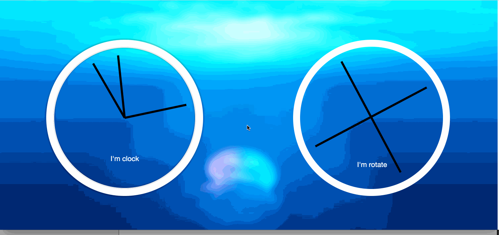

# JS30 - 02



## box-shadow
- [box-shadow 详解](http://www.w3cplus.com/content/css3-box-shadow)
```
box-shadow: X轴偏移量 Y轴偏移量 阴影模糊半径  阴影扩展半径  阴影颜色 投影方式
box-shadow: h-shadow v-shadow blur        spread      color   inset
```

  - 阴影模糊半径
    `模糊值` `正值`
  - 阴影扩展半径
    这个是阴影的`尺寸` 或者 `宽度` `可正可负` ，正值表示增加，负值表示减少，为0或负数的时候，我没看到效果...😭 如果添加上 `inset` 属性，则相反，负值表示向内增加，正值表示减少 
  - 投影方式`inset`
    这个表示向内投影  

  - **多个阴影用逗号`,`隔开**

## transform
  - [transform 详解](http://www.w3cplus.com/content/css3-transform)
  ```
  旋转rotate、扭曲skew、缩放scale 移动translate 矩阵变形matrix
  ```
