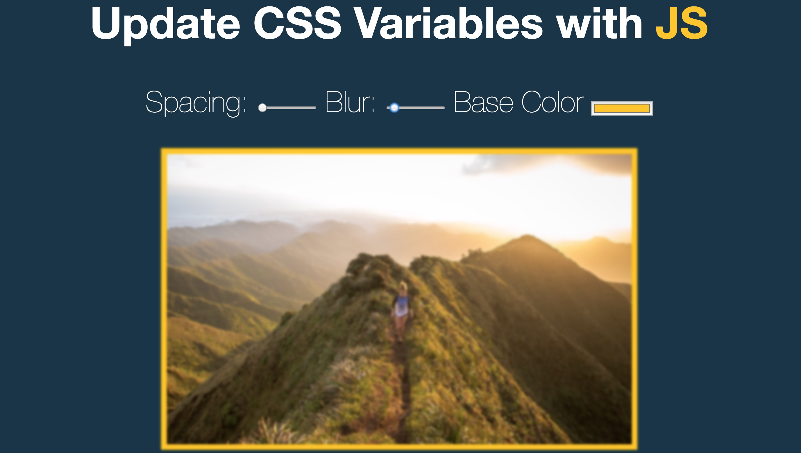

# JS30 - 03

[**CSS 变量**](https://developer.mozilla.org/zh-CN/docs/Web/CSS/Using_CSS_variables)



## :root伪类

`:root` 伪类，匹配文档根元素

```css
:root{
  --base-color:#FFFFFF
}
```

## 变量声明

```css
--变量名    : 变量值
--var_name : var_value
```

## 变量使用

```css
color : var(--变量名)
color : var(--var_name)
```

## dataset

```html
<input type="range" name="spacing" min="10" max="200" value="10" data-sizing="px">
```

其中data-*就是我们要讲的dataset啦，他会保存在`dataset`中，`属性值`只能是`字符串`，非字符串会转换为字符串后存储