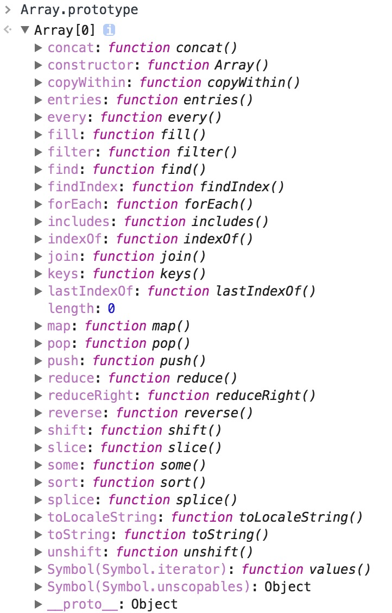

# JS30 - 07

数组一些方法

- [MDN - Array](https://developer.mozilla.org/zh-CN/docs/Web/JavaScript/Reference/Global_Objects/Array)

## some
**任意一个满足条件返回**

## every
**所有满足条件返回**

## find
**查找满足条件并返回该值**

## findIndex
**查找满足条件并返回下标**

## slice
**根据下标切割数组**
