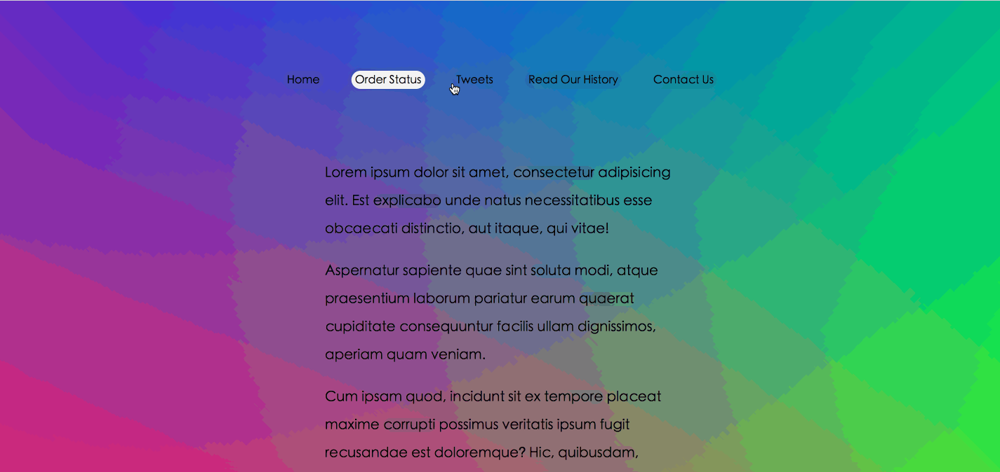

这个有意思啦😀,鼠标进入时的样式设置

**原理** 鼠标进入事件`mouseenter`监听,通过获取当前元素位置`getBoundingClientRect()`来定位背景元素位置并元素的CSS样式，样式中主要通过`transition`设置过渡，`position: absolute`设置定位效果，`z-index: -1` 设置为背景底色,以前都看别人使用这样的效果，现在嘛，我笑了...